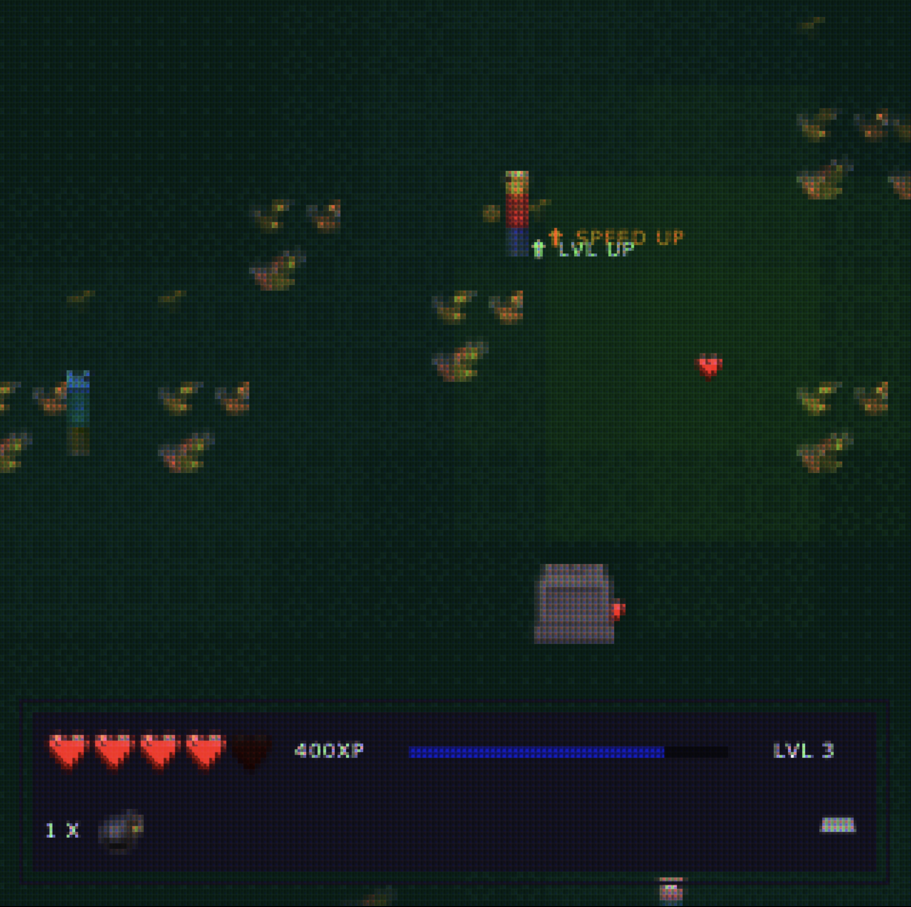
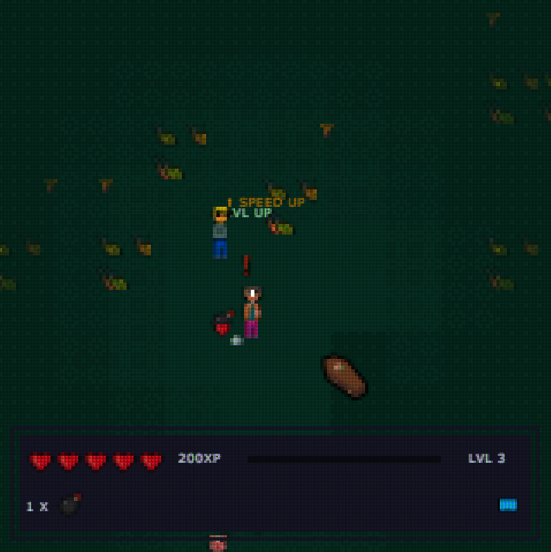
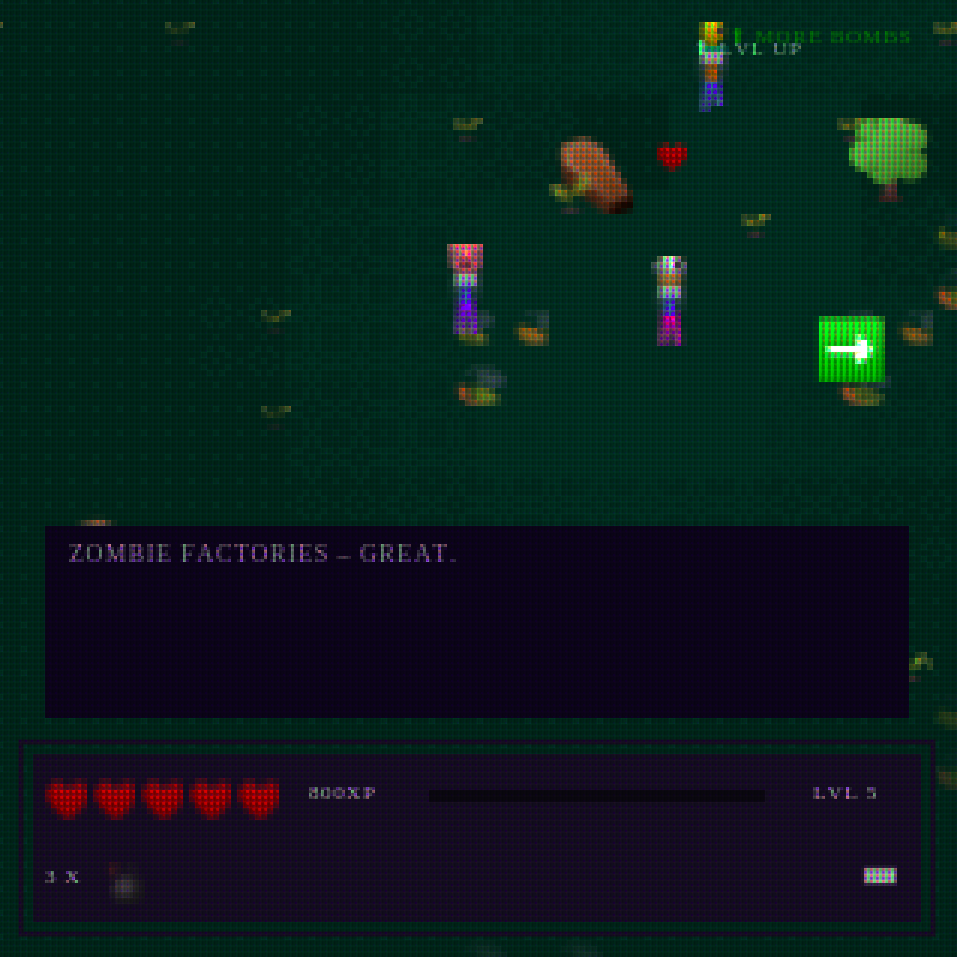

# Gravepassing 🪦

This is repository for Gravepassing - retro-style browser-based video game written in TypeScript for js13kgames 2022 competition.

## Build 🛠
[Build available here](./game.zip).

11628 / 13312 B = 87.35%

## Story 📚
You’re alone in a graveyard, hounded by armies of the undead. Can you escape death and rescue all of humanity?

Set to 8-bit music, Gravepassing evokes Game Boy aesthetics with a 16x16 base tile grid, downscaled emojis and dithered ligthing for that overall retro vibe.  

You can play the game with a keyboard or controller.

CONTROLS

Keyboard:
Move = [Arrow Keys]
Fire = [Space]
Drop bomb = [X]
Menu = [ESC]

Controller:
Move = left joystick
Fire = (A)
Drop bomb = (B)
Menu = (Options) / (Menu)

The game should work on any operating system in Chrome / Firefox but it was primarily designed for MacOS emojis and looks the best in there. It adapts to other platforms too, you can say those are platform exclusive versions ;)

Written in TypeScript.

## Screenshots 🖼
### MacOS

### Windows

### Ubuntu

## Features ✨
- No assets - everything is built with Emojis! 🤪
- 16x16 tile grid system
- Evokes GameBoy Color / early handheld era vibe
- 8-bit(ish) music
- Dither effect for lighting
- Written in TypeScript
- 3 difficulty levels (changed in the menu accessible via ESC key)
- Ability to turn off postprocessing effects
- 3 stages with unique vibe and soundtrack
- "Exclusive" platform versions - game renders in native system emojis (big chunky outline on Windows, beautiful MacOS emojis and in-between version on Ubuntu)

Tested on MacOS (looks the best), Windows 7 and Ubuntu.

## Build process 📦
- Custom script to rename classes / methods / properties
- Parcel production mode
- Uglify
- Roadroller (❤️)
- advzip

## Authors and attributions 🐙
Made by [Kacper "kulak" Kula](https://twitter.com/kulak_at).

Big thanks to Rae for ideas, brain storming, testing and improvements!